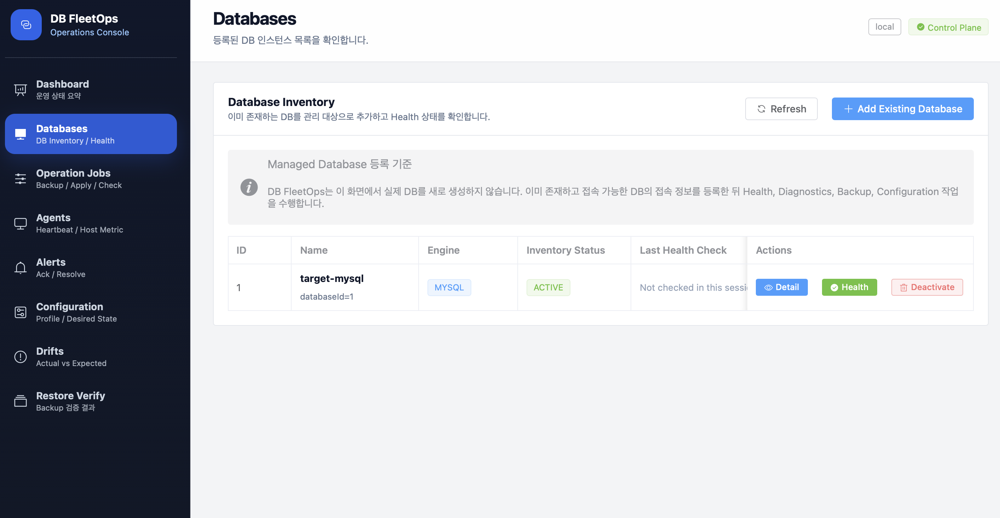
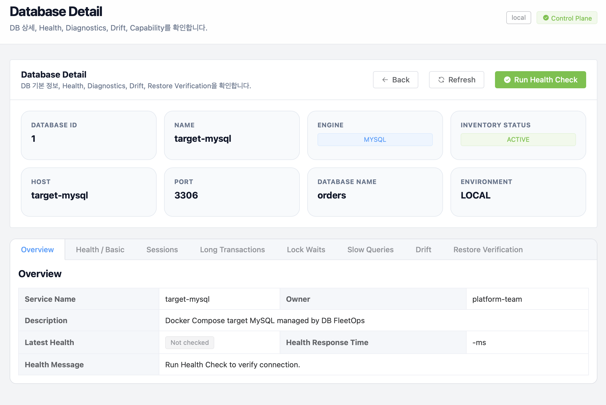
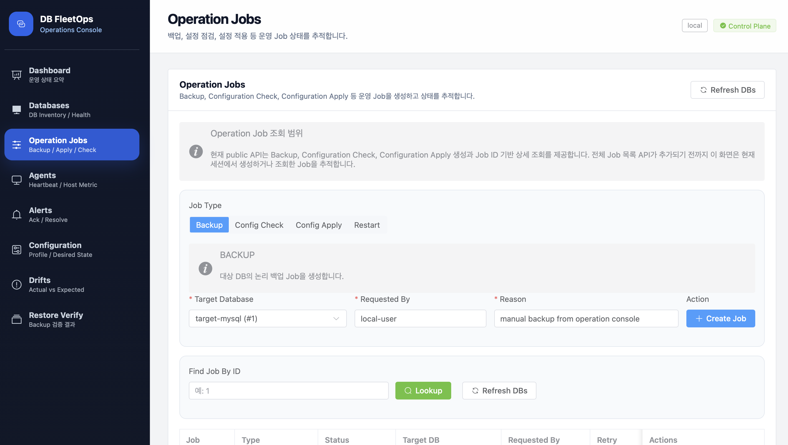
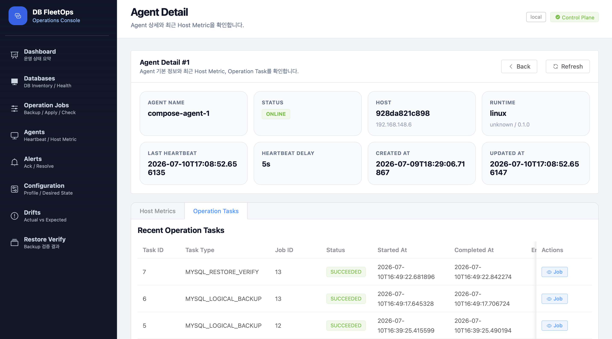
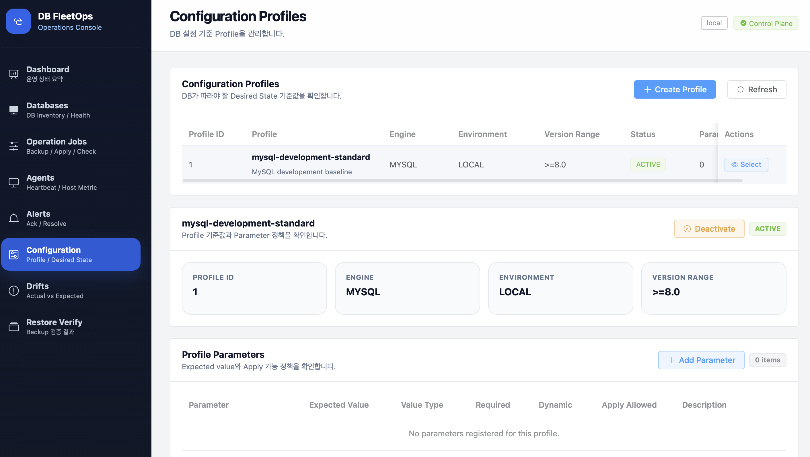
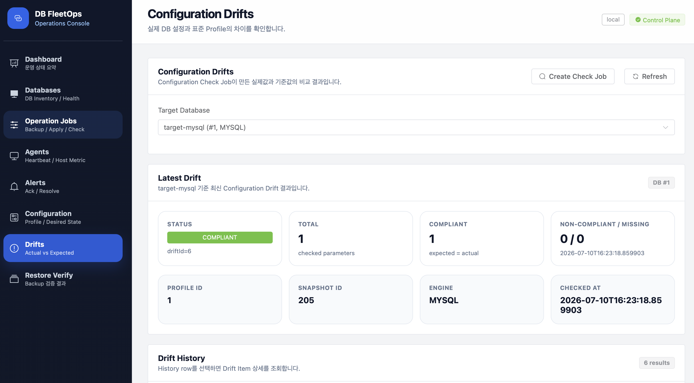
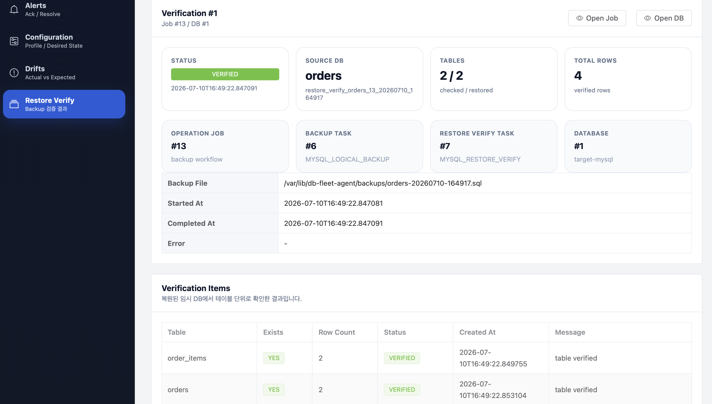

# DB FleetOps

DB FleetOps는 여러 MySQL을 한 곳에서 관리하는 운영 도구입니다.

관리할 Database를 등록하고, 백업이나 설정 점검 같은 오래 걸리는 일을 안전하게 실행하며, 그 결과를 화면과 API에서 확인할 수 있습니다.

## 1. 상세 문서

README는 전체 구조만 설명합니다. 설계 근거와 테스트 결과는 다음 문서에서 확인할 수 있습니다.

| 문서 | 내용 |
|---|---|
| [DB FleetOps가 해결하려는 문제](docs/1-DB-FleetOps가-해결하려는-문제.md) | 프로젝트 목적과 구현 범위 |
| [자동 테스트와 실패 재현 전략](docs/2-자동-테스트와-실패-재현-전략.md) | 테스트 구분과 실행 방법 |
| [비동기 작업 처리를 위한 Job 구조](docs/3-비동기-작업-처리를-위한-Job-구조.md) | Job 상태, 중복 요청 방지와 Worker 실행권 |
| [중앙 관제 서버와 Go Agent 분리 구조](docs/4-중앙-관제-서버와-Go-Agent-분리-구조.md) | Agent Pull 통신, Task 실행권과 실패 대응 |
| [백업 Job과 Agent Task 실행 구조](docs/5-백업-Job과-Agent-Task-실행-구조.md) | 백업 Task와 Job 상태 연결 |
| [Database 설정 차이 점검 구조](docs/6-Database-설정-차이-점검-구조.md) | 설정 기준, 실제 설정 기록과 설정 차이 |
| [운영 Database 설정 안전 변경 구조](docs/7-운영-Database-설정-안전-변경-구조.md) | 설정 변경 검증과 전·후 확인 |
| [백업 복원 검증 구조](docs/8-백업-복원-검증-구조.md) | 백업 파일의 실제 복원과 검증 |
| [DB FleetOps 배포와 관측성](docs/9-DB-FleetOps-배포와-관측성.md) | Docker Compose, Kubernetes와 운영 지표 |
| [용어 정리](docs/용어%20정리.md) | 문서와 코드에서 사용하는 공통 용어 |
| [도메인 정리](docs/도메인%20정리.md) | 도메인별 역할과 규칙 |
| [유스케이스별 객체 관계](docs/diagram/유스케이스별-객체-관계.md) | 주요 유스케이스의 객체와 메시지 관계 |

## 2. 무엇을 할 수 있나요?

- 관리 Database의 접속 상태와 기본 정보를 확인합니다.
- 백업을 만들고 실제로 복원되는지 검증합니다.
- 운영 기준과 실제 Database 설정의 차이를 찾습니다.
- 허용된 설정만 변경하고 변경 전·후 값을 남깁니다.
- Job과 Task의 진행 상태, Agent 상태와 실행 결과를 추적합니다.

## 3. 핵심 용어

| 용어 | 쉬운 설명 |
|---|---|
| 관리 Database (`ManagedDatabase`) | DB FleetOps에 등록하여 관리하는 Database |
| 운영 Job (`OperationJob`) | 운영자가 달성하려는 하나의 목표. 예: “주문 Database를 백업하고 복원 가능성을 확인한다” |
| 운영 Task (`OperationTask`) | Job을 완료하기 위해 Agent가 한 번에 실행하는 구체적인 일. 예: 백업 파일 생성 |
| Worker | 대기 중인 Job을 가져와 실행 순서와 상태를 조정하는 중앙 관제 서버의 구성요소 |
| Agent | Database Host 가까이에서 Task를 가져와 실제 명령을 실행하는 프로그램 |
| 설정 기준 (`ConfigurationProfile`) | Database가 따라야 할 설정값 묶음 |
| 실제 설정 기록 (`ConfigurationSnapshot`) | 특정 시점에 Database에서 수집한 실제 설정값 |
| 설정 차이 (`ConfigurationDrift`) | 설정 기준과 실제 설정을 비교해서 찾은 차이 |
| Task 실행권 | 특정 실행 번호의 Agent만 정해진 시간 동안 Task를 처리할 수 있는 권한 |

Job과 Task는 다음처럼 구분합니다.

```text
백업하고 복원 가능한지 확인한다       운영 Job
  ├─ 백업 파일을 만든다              운영 Task
  └─ 임시 Database에 복원해 확인한다  운영 Task
```

## 4. 화면에서 확인할 수 있는 것

### 관리 Database

등록된 Database의 상태와 기본 정보를 확인합니다.



Database 상세 화면에서는 접속 정보와 관련 운영 정보를 확인합니다.



### 운영 Job

백업과 설정 점검 같은 운영 목표가 어디까지 진행됐는지 확인합니다.



### Agent

등록 상태, 최근 생존 연락과 Agent가 실행한 Task를 확인합니다.



### 설정 기준과 설정 차이

Database가 따라야 할 설정 기준을 등록합니다.



설정 기준과 실제 설정이 다른 항목을 확인합니다.



### 복원 검증

백업 파일을 임시 Database에 복원한 결과와 검증 내용을 확인합니다.



## 5. 어떻게 동작하나요?

```text
운영자
  │ 운영 Job 요청
  ▼
중앙 관제 서버 ── Job과 Task 상태 저장 ── Metadata Database
  │
  ├─ Worker가 Job의 실행 순서와 상태를 조정
  │
  └─ Agent가 Task를 가져갈 수 있도록 제공
                    │
                    ▼
              Go Agent
                    │ Host 안에서 명령 실행
                    ▼
              관리 Database
```

중앙 관제 서버는 요청과 실행 상태를 관리하고, 실제 Host 작업은 Go Agent가 수행합니다. Agent가 중앙 관제 서버에 먼저 연결해 Task를 가져가므로 Agent용 외부 수신 Port가 필요하지 않습니다.

오래 걸리는 실행이 중간에 끊겨도 Task가 계속 `RUNNING`에 머물지 않도록 Task 실행권과 실행 번호를 사용합니다. 같은 결과가 다시 보고되면 결과 보고 번호로 중복을 확인하여 후속 Task나 결과가 두 번 만들어지지 않게 합니다.

## 6. 주요 실행 흐름

### 백업과 복원 검증

```text
백업 Job 생성
  → 백업 Task 실행
  → 백업 파일 생성
  → 복원 검증 Task 실행
  → 임시 Database에 복원
  → 검증 통과 시 Job 성공
```

백업 파일이 만들어진 것만으로 성공 처리하지 않습니다. 복원 검증이 필요한 Job은 실제 복원과 검증까지 끝나야 성공합니다.

### 설정 차이 점검

```text
설정 기준 선택
  → 실제 설정 수집
  → 실제 설정 기록 저장
  → 기준과 실제 값 비교
  → 설정 차이 저장
```

이 흐름은 Database 설정을 바꾸지 않고 차이만 확인합니다.

### 안전한 설정 변경

```text
변경 요청 검증
  → 변경 전 실제 설정 기록
  → 허용된 설정 변경
  → 변경 후 실제 설정 기록
  → 반영 결과 확인
```

설정 변경은 허용 여부와 값 형식을 먼저 검사하며, 변경 전·후 값을 함께 남깁니다.

## 7. 로컬 실행

Credential 암호화 Key를 설정하고 전체 구성을 실행합니다. Key에는 Base64로 인코딩한 32-byte 값을 사용합니다.

```bash
export DB_FLEETOPS_CREDENTIAL_ENCRYPTION_KEY='<Base64 32-byte key>'
docker compose up --build -d
```

| 구성요소 | 접속 위치 |
|---|---|
| API | http://localhost:8080 |
| Worker | http://localhost:8081 |
| Prometheus | http://localhost:9090 |
| Grafana | http://localhost:3000 |

실행 중인 구성요소의 기본 연결 상태는 다음 명령으로 확인합니다.

```bash
./scripts/smoke-test-compose.sh
```

종료할 때는 다음 명령을 사용합니다.

```bash
docker compose down
```

`docker compose down -v`는 Metadata Database와 Agent 데이터까지 지우므로 전체 초기화가 필요할 때만 사용합니다.

## 8. 테스트

```bash
# 빠른 Java 테스트
./gradlew test

# 실제 MySQL 연결 테스트
./gradlew integrationTest

# Agent 장애와 응답 유실 재현 테스트
./gradlew agentFailureTest --rerun-tasks --console=plain

# 중앙 관제 서버와 Agent 분리 구조 검증
./gradlew architectureTest --rerun-tasks --console=plain

# Go Agent 테스트
cd agent-go && go test ./...
```

Docker가 필요한 테스트는 일반 단위 테스트와 분리되어 있습니다. 자세한 범위는 [자동 테스트와 실패 재현 전략](docs/2-자동-테스트와-실패-재현-전략.md)을 참고합니다.

## 9. 기술 구성

| 영역 | 사용 기술 |
|---|---|
| 중앙 관제 서버와 Worker | Java 21, Spring Boot 3.5, Gradle |
| Agent | Go |
| Metadata·관리 Database | MySQL 8.4 |
| 로컬 실행 | Docker Compose |
| 배포 예제 | Kubernetes, Kustomize |
| 관측 | Spring Boot Actuator, Prometheus, Grafana |
| 테스트 | JUnit 5, Mockito, AssertJ, MockMvc, Go test |

## 10. 현재 범위와 보완할 점

- 현재 주요 실행 대상은 MySQL입니다.
- Kubernetes 구성은 로컬 학습과 구조 검증을 위한 예제이며 운영용 완성본이 아닙니다.
- Metadata Database 고가용성, Schema Migration, TLS와 외부 Secret 관리는 운영 적용 전에 보완해야 합니다.
- 대용량 백업의 CPU·Disk 부하와 장시간 실행은 실제 운영 환경과 비슷한 장비에서 추가 검증해야 합니다.
