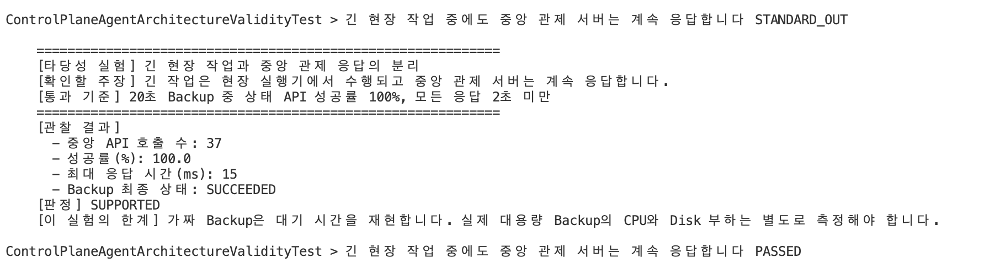
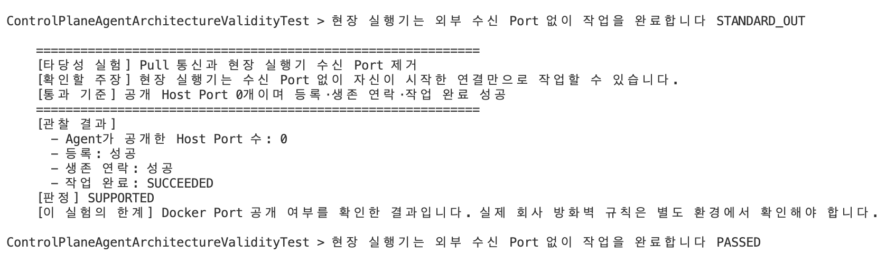
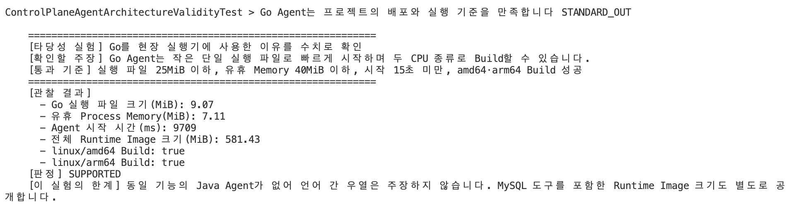
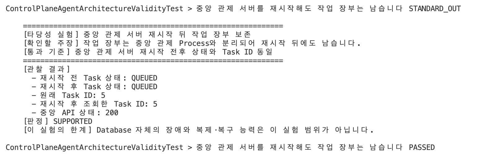
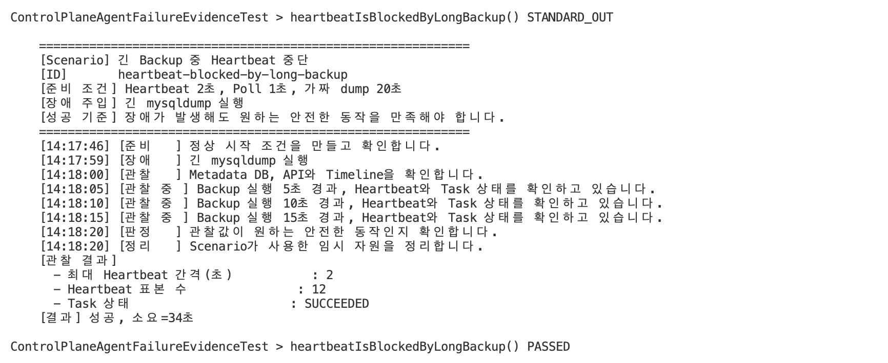
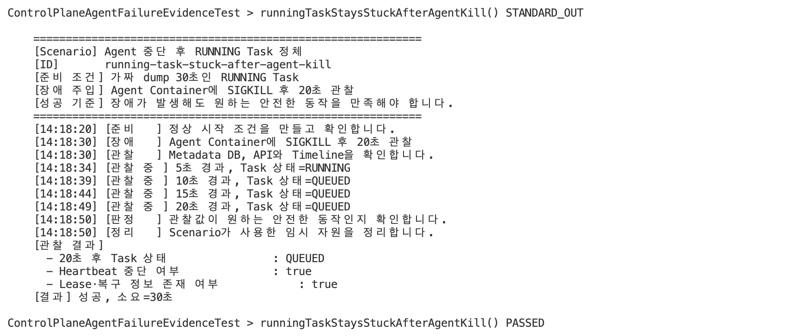
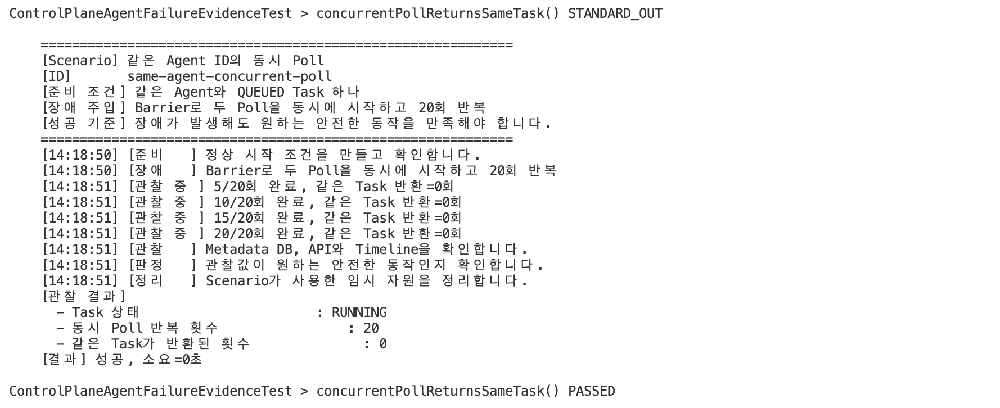
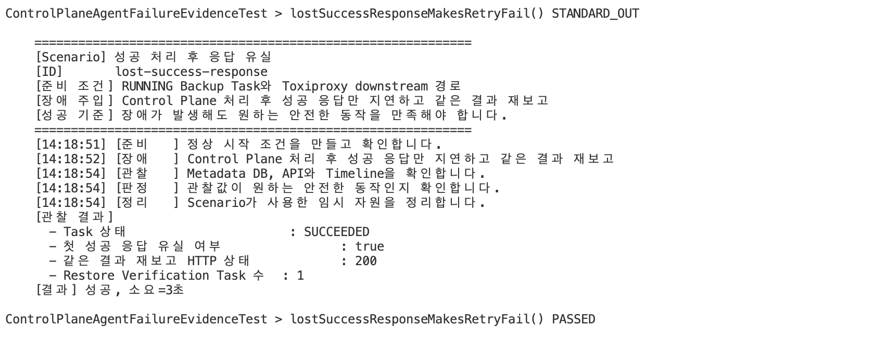

# 중앙 관제 서버와 Go Agent 분리 구조

## 1. 결론

DB FleetOps는 작업을 관리하는 중앙 관제 서버(Control Plane)와 실제 작업을 수행하는 현장 실행기(Agent)를 분리했습니다.

식당으로 비유하면 중앙 관제 서버는 주문을 정리하는 주방장이고, 현장 실행기는 주문표를 받아 요리하는 요리사입니다. 주방장은 무엇을 언제 처리할지 관리하고, 요리사는 자신에게 배정된 일만 실행합니다.

실험에서 다음 장점을 확인했습니다.

- 현장 실행기가 긴 작업을 수행해도 중앙 관제 서버는 계속 응답했습니다.
- 현장 실행기는 외부 수신 Port 없이 작업을 받아 완료했습니다.
- 현장 실행기 하나를 강제로 종료해도 다른 실행기와 중앙 관제 서버는 계속 동작했습니다.
- 중앙 관제 서버를 재시작해도 작업 장부는 남았습니다.
- Go 현장 실행기는 프로젝트에서 정한 배포와 실행 기준을 만족했습니다.

구조를 분리한 방향은 타당했습니다. 작업 전달 과정에서 확인한 네 가지 실패 중 Heartbeat 중단, 죽은 Agent의 Task 정체, 동시 Poll 중복 선점은 보완했습니다. 완료 응답 유실 뒤 같은 결과를 재전송하는 문제는 아직 남아 있습니다.

## 2. 각 구성요소가 맡은 일

### 중앙 관제 서버

중앙 관제 서버는 전체 작업의 목적과 상태를 관리합니다.

- 관리 대상 데이터베이스를 관리합니다.
- 사용자가 요청한 전체 작업인 `OperationJob`을 관리합니다.
- 현장 실행기가 처리할 작업인 `OperationTask`를 만듭니다.
- 현장 실행기의 등록과 생존 연락을 받습니다.
- 작업 시작과 완료 결과를 작업 장부에 저장합니다.

### Worker

Worker는 실행할 수 있는 `OperationJob`을 가져와 전체 순서를 진행합니다.

예를 들어 백업 작업이라면 백업 파일 생성이 끝난 뒤 복원 확인 작업이 이어지도록 조정합니다.

### Go 현장 실행기

현장 실행기는 자신에게 배정된 작업을 조회하고 실제 명령을 실행합니다.

현재 실행할 수 있는 작업은 다음과 같습니다.

- Linux 상태 수집
- MySQL 논리 백업
- MySQL 백업 복원 확인

현장 실행기는 중앙 관제 서버처럼 전체 작업의 성공 여부를 판단하지 않습니다. 자신이 맡은 하나의 작업을 실행하고 결과만 보고합니다.

## 3. 왜 분리했는가

Linux 상태 수집과 MySQL 백업은 실제 데이터베이스가 운영되는 환경 가까이에서 수행해야 합니다.

중앙 관제 서버가 모든 데이터베이스 Host에 직접 접속해 명령을 실행하면 중앙 서버가 다음 내용을 모두 책임져야 합니다.

- 각 Host로 들어가는 통신 경로
- 데이터베이스 인증 정보
- `mysqldump`와 `mysql` 같은 실행 도구
- 백업 파일을 저장할 위치
- Host마다 다른 운영체제 환경

현장 실행기를 분리하면 중앙 관제 서버는 “무엇을 해야 하는가”를 관리하고, 현장 실행기는 “현장에서 어떻게 실행하는가”를 담당합니다.

```text
사용자 요청
  → 중앙 관제 서버가 전체 작업을 기록합니다
  → Worker가 실행 순서를 정합니다
  → 현장 실행기가 자신에게 배정된 작업을 조회합니다
  → 현장 실행기가 실제 명령을 실행합니다
  → 결과를 중앙 관제 서버에 보고합니다
```

실제 실험에서도 20초짜리 백업이 현장 실행기에서 수행되는 동안 중앙 관제 서버의 상태 API는 100% 응답했습니다. 세 번 실행하는 동안 가장 느린 응답은 15ms였습니다.



따라서 긴 작업을 중앙 관제 서버와 다른 Process에서 실행한다는 장점은 확인되었습니다.

## 4. 왜 현장 실행기가 작업을 가져가는가

현재 구조에서는 중앙 관제 서버가 현장 실행기에 직접 접속하여 작업을 밀어 넣지 않습니다. 현장 실행기가 중앙 관제 서버에 다음 작업을 물어봅니다. 이를 Pull 방식이라고 합니다.

```text
현장 실행기
  → 등록합니다
  → 생존 연락을 보냅니다
  → 다음 작업을 물어봅니다
  → 작업 Lease를 갱신하고 결과를 보고합니다
```

택배 기사가 본사에 전화해 다음 배송 건을 받아가는 것과 같습니다. 본사가 기사 개인 기기에 직접 접속할 필요가 없습니다.

실험에서는 현장 실행기의 외부 공개 Port를 0개로 두었습니다. 이 상태에서도 다음 과정이 모두 성공했습니다.



- 현장 실행기 등록
- 생존 연락
- 작업 조회
- 백업 실행
- 작업 완료 보고

따라서 현장 실행기가 먼저 시작한 연결만으로 전체 작업 흐름이 동작한다는 사실을 확인했습니다.

## 5. 왜 Go를 사용했는가

현장 실행기는 여러 데이터베이스 Host에 배포됩니다. 따라서 실행 파일이 작고, 사용하지 않을 때 Memory를 적게 차지하며, 서로 다른 CPU 환경에서 만들 수 있어야 합니다.

결과를 본 뒤 기준을 바꾸지 않도록 다음 기준을 먼저 정했습니다.

| 확인 항목 | 기준 |
|---|---|
| 실행 파일 크기 | 25MiB 이하 |
| 사용하지 않을 때 Memory | 40MiB 이하 |
| Container 시작 시간 | 15초 미만 |
| Intel·AMD 계열 Linux 실행 파일 | Build 성공 |
| ARM 계열 Linux 실행 파일 | Build 성공 |

같은 환경에서 측정한 결과는 다음과 같습니다.



Go 현장 실행기는 프로젝트에서 정한 기준을 모두 만족했습니다. 따라서 여러 Host에 배포하는 실행기로 Go를 선택한 근거가 있습니다.

다만 전체 Container Image는 581.43MiB입니다. Go 실행 파일은 작지만 실제 백업과 복원에 필요한 MySQL 도구가 함께 들어 있기 때문입니다. 작은 작업자가 무거운 공구 가방을 들고 있는 것과 같습니다.

이 실험은 Go가 다른 언어보다 항상 좋다는 뜻이 아닙니다. 현재 Go 구현이 이 프로젝트에서 정한 기준을 만족한다는 뜻입니다.

## 6. 전체 작업과 현장 작업을 나눈 이유

`OperationJob`은 사용자가 원하는 전체 목적입니다. `OperationTask`는 그 목적을 이루기 위해 현장 실행기가 처리하는 하나의 작업입니다.

예를 들어 사용자는 “백업이 실제로 복원 가능한지 확인해 주세요”라고 요청할 수 있습니다.

```text
OperationJob: 백업과 복원 확인
  ├── OperationTask: MySQL 백업 파일 생성
  └── OperationTask: 백업 파일 복원 확인
```

백업 파일 생성은 성공해도 복원 확인은 실패할 수 있습니다. 전체 목적과 개별 실행 결과를 나누어야 어느 단계에서 문제가 발생했는지 알 수 있습니다.

중앙 관제 서버를 재시작하는 실험에서도 작업 상태와 Task ID가 그대로 유지되었습니다. 작업 장부가 중앙 관제 Process와 별도로 저장된다는 사실을 확인했습니다.



## 7. 임의 명령을 실행하지 않는 이유

현장 실행기는 중앙 관제 서버가 보낸 임의의 Shell 명령을 그대로 실행하지 않습니다. 미리 구현된 작업 종류만 실행합니다.

예를 들어 중앙 관제 서버가 다음 문자열을 보내고 현장 실행기가 그대로 실행하는 구조는 사용하지 않습니다.

```json
{
  "command": "임의의 shell command"
}
```

현재 현장 실행기는 등록된 Handler가 지원하는 작업 종류만 실행합니다. `mysqldump`를 실행할 때도 Shell 문자열을 조합하지 않고 프로그램 이름과 인자를 나누어 전달합니다.

이는 현장 실행기가 원격 Shell처럼 사용되는 범위를 줄입니다.

## 8. 작업 전달 실패를 어떻게 해결했는가

### 8.1 긴 백업 중 Heartbeat 중단

기존에는 Heartbeat와 작업 실행이 같은 흐름에 있어, 20초 백업 중 Heartbeat 간격이 21초까지 늘어났습니다.

Heartbeat와 작업 실행을 별도 goroutine으로 분리했습니다. 변경 후 같은 실험에서 최대 Heartbeat 간격은 2초였고 Task도 `SUCCEEDED`로 완료되었습니다.

코드는 간단히 다음처럼 나누었습니다.

```text
AgentService.Run(...)
  ├─ runHeartbeatLoop(...) : Heartbeat만 계속 전송
  └─ PollAndHandleTask(...) : Task 조회와 실행 담당
```

즉, 작업이 오래 걸려도 Heartbeat goroutine은 기다리지 않고 별도로 움직입니다.



### 8.2 Agent 종료 후 `RUNNING` Task 정체

Task를 선점할 때 다음 실행 정보를 저장하도록 변경했습니다.

- `executionAttempt`: 현재 실행 시도 횟수
- `leaseExpiresAt`: 실행 권한 만료 시각
- `lastProgressAt`: 마지막 Lease 갱신 시각

Agent는 작업 중 20초마다 60초 Lease를 갱신합니다. Agent가 종료되어 갱신하지 못하면 중앙 관제 서버가 Task를 `QUEUED`로 되돌립니다. 같은 Agent를 다시 시작한 실험에서는 동일한 Task ID를 실행 횟수를 2로 다시 받아 `SUCCEEDED`로 완료했습니다.



이 과정에서도 다른 Agent의 Task는 `SUCCEEDED`로 완료됐고 중앙 상태 API는 HTTP 200을 유지했습니다.

최초 실행을 포함해 세 번 모두 Lease가 만료되면 Task와 연결된 `OperationJob`을 `TIMED_OUT`으로 종료합니다. 이전 실행 번호로 뒤늦게 도착한 갱신·완료·실패 요청은 HTTP 409로 거절합니다.

코드는 다음 역할로 나누었습니다.

- Go Agent의 `maintainTaskLease(...)`가 작업 중 Lease를 주기적으로 갱신합니다.
- `ExpiredOperationTaskScheduler`가 일정 시간마다 만료 Task 검사를 시작합니다.
- `ExpiredOperationTaskService`가 만료 Task를 Lock으로 가져와 재대기 또는 최종 시간 초과를 결정합니다.
- `OperationTask`가 `requeueExpiredLease(...)`, `timeoutExpiredLease(...)`로 실제 상태를 변경합니다.

쉽게 말하면 Agent는 “아직 작업 중”이라고 계속 알리고, 중앙 서버는 연락이 끊긴 Task를 찾아 다시 실행할 수 있게 정리합니다.

### 8.3 동시 Poll의 중복 Task 반환

기존에는 Task 조회와 시작이 나뉘어 있어 두 Poll이 같은 `QUEUED` Task를 받을 수 있었습니다.

현재는 `POST /tasks/next`가 다음 과정을 하나의 Transaction에서 처리합니다.

```text
QUEUED Task 조회와 Lock
  → RUNNING 전환
  → 실행 번호 증가와 Lease 설정
  → 선점한 Task 반환
```

같은 Agent로 두 Poll을 동시에 보내는 실험을 20회 반복한 결과, 같은 Task가 두 요청에 반환된 횟수는 0회였습니다.



코드는 다음 역할로 나누었습니다.

- `AgentOperationTaskController.nextTask(...)`가 `POST /tasks/next` 요청을 받습니다.
- `OperationTaskClaimService.claimNext(...)`가 Agent Token을 확인하고 선점 Transaction을 관리합니다.
- `OperationTaskRepository.findTop1ByAgentIdAndStatusOrderByCreatedAtAsc(...)`가 `PESSIMISTIC_WRITE` Lock으로 가장 오래된 `QUEUED` Task를 하나만 가져옵니다.
- `OperationTask.claim(...)`이 상태를 `RUNNING`으로 바꾸고 실행 번호와 Lease 시각을 기록합니다.

Controller는 HTTP 요청만 받고, 선점 순서는 Service가 관리하며, 상태 변경 규칙은 `OperationTask` 안에 둔 구조입니다.

### 8.4 완료 응답 유실 뒤 같은 결과 재전송

성공·실패 요청에 Agent가 만든 `resultReportId` UUID를 포함하고, 중앙 관제 서버는 실행 번호, 결과 종류와 결과 내용의 SHA-256을 Task에 저장합니다.

이미 끝난 Task에 같은 실행 번호·UUID·종류·내용이 다시 오면 기존 결과를 HTTP 200으로 반환합니다. 이때 상태 변경, Host Metric 저장과 복원 확인 Task 생성을 다시 실행하지 않습니다. UUID나 내용이 다르면 HTTP 409로 거절합니다.

응답만 유실한 뒤 같은 성공 결과를 다시 보낸 실험에서 재요청은 HTTP 200을 받았고, 복원 확인 Task는 한 개만 생성되어 테스트가 성공했습니다.

코드는 다음 순서로 처리합니다.

```text
완료·실패 요청
  → OperationTaskService가 Task 행을 Lock
  → OperationTaskResultFingerprint가 결과 내용의 SHA-256 계산
  → OperationTask가 최초 보고인지 같은 보고의 재전송인지 판단
  → 최초 보고만 상태 변경과 후속 작업 수행
```

- `OperationTask.acceptSuccessReport(...)`와 `acceptFailureReport(...)`가 `ACCEPTED` 또는 `DUPLICATE`를 반환합니다.
- `OperationTaskService`는 `DUPLICATE`이면 즉시 기존 결과를 반환하므로 Metric과 복원 확인 Task를 다시 만들지 않습니다.

즉, 같은 영수증 번호와 같은 내용을 다시 보내면 이미 처리한 요청으로 보고 기존 답을 돌려주는 구조입니다.



## 9. 실행 방법

### 분리 구조의 장점 확인

```bash
FAILURE_TEST_REQUIRE_DOCKER=true \
./gradlew architectureTest --rerun-tasks --console=plain
```

현재 다섯 실험이 모두 성공합니다.

### 작업 전달 실패 확인

```bash
FAILURE_TEST_REQUIRE_DOCKER=true \
./gradlew agentFailureTest --rerun-tasks --console=plain
```

Heartbeat, Lease 회수, 동시 선점, 완료 응답 유실 후 결과 재전송 실험이 모두 성공합니다.

## 10. 결론

중앙 관제 서버와 현장 실행기를 분리한 구조는 현재 실험 범위에서 목적에 맞습니다.

- 긴 현장 작업이 중앙 관제 서버의 응답을 막지 않았습니다.
- 외부 수신 Port 없이 Pull 방식으로 작업을 완료했습니다.
- 한 현장 실행기의 장애가 다른 실행기와 중앙 서버를 중단시키지 않았습니다.
- 중앙 서버를 재시작해도 작업 장부가 유지되었습니다.
- Go 현장 실행기는 정한 배포 기준을 만족했습니다.

생존 연락 분리, Task Lease, 실행 번호, 원자적 선점과 결과 보고 멱등 처리를 보완했습니다.
