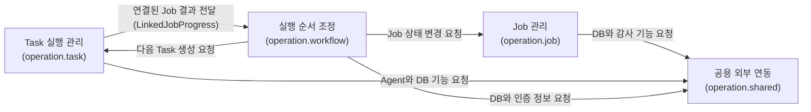
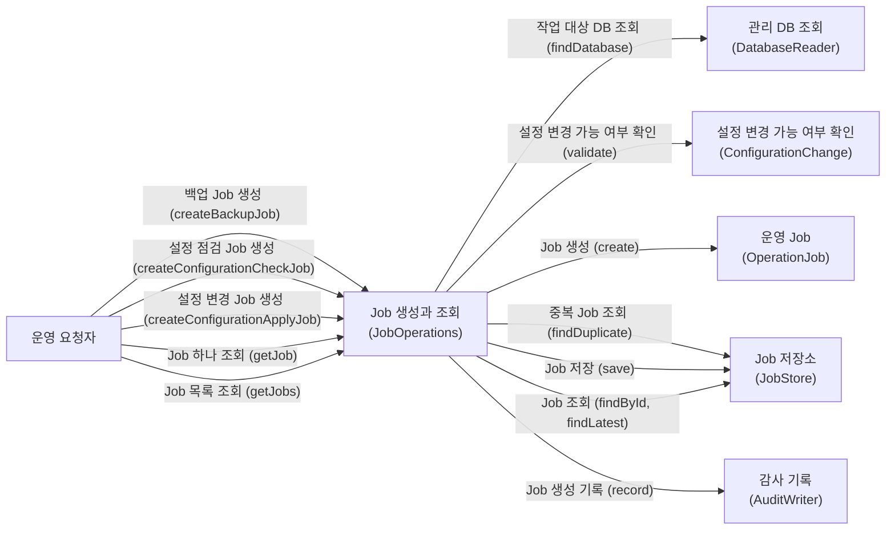
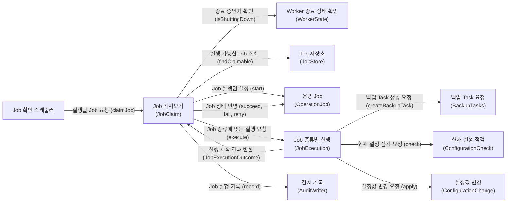
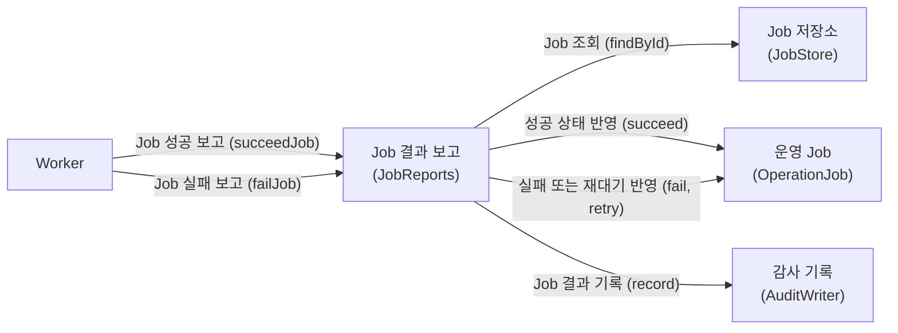
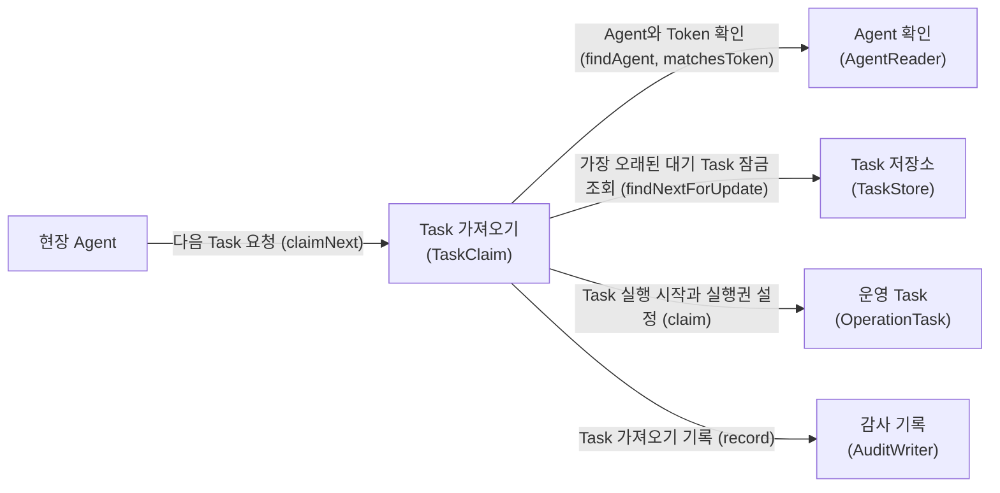
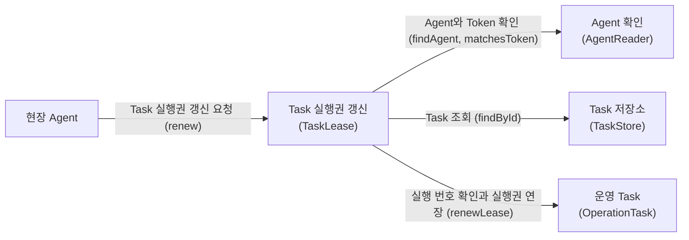
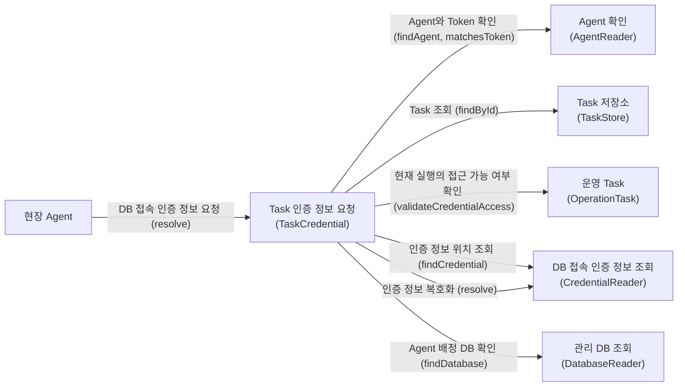
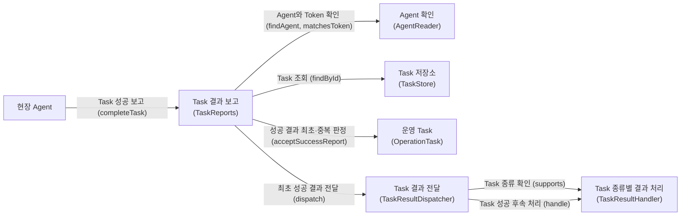
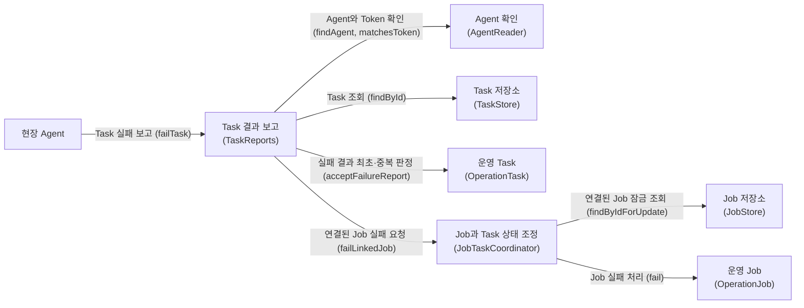
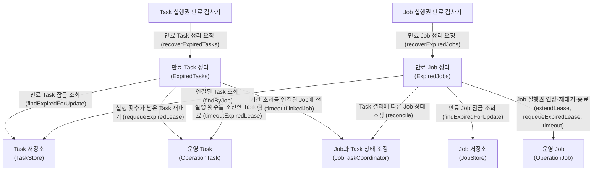

# Operation 유스케이스별 객체 관계

구현 클래스보다는 외부에서 사용하는 인터페이스와 도메인 모델을 표시합니다.
화살표에는 전달하는 요청을 한글로 쓰고, 실제 메서드 이름은 괄호 안에 표시합니다.

## Operation 내부 모듈

`Task → Workflow` 연결은 Workflow 구현체를 직접 호출하는 관계가 아닙니다.
Task가 선언한 요청 인터페이스인 `LinkedJobProgress`를 Workflow가 구현합니다.

## 1. Job 생성과 조회

## 2. Worker의 Job 가져오기와 실행 시작

## 3. Worker의 Job 결과 보고

## 4. Agent의 Task 가져오기

## 5. Task 실행권 갱신

## 6. Task 실행용 DB 접속 인증 정보 조회

## 7. Task 성공 결과 보고

## 8. Task 실패 결과 보고

## 9. 만료된 Task와 Job 정리

