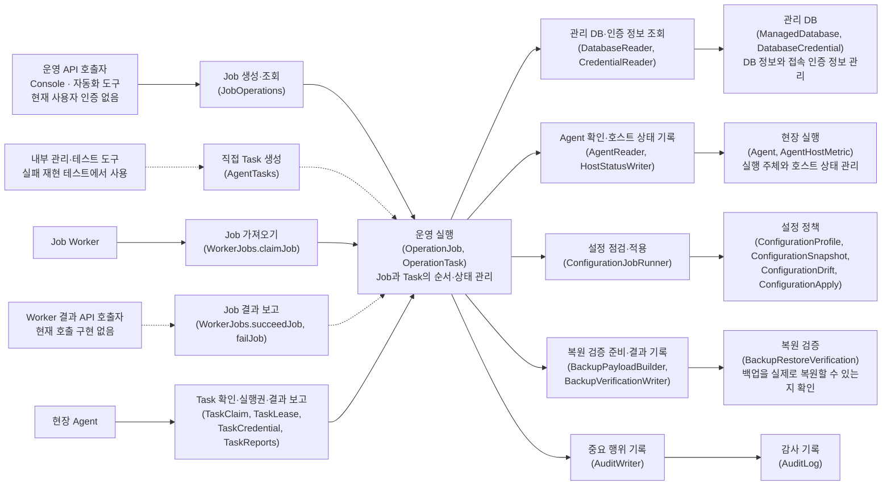
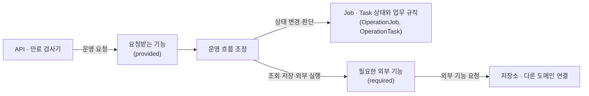
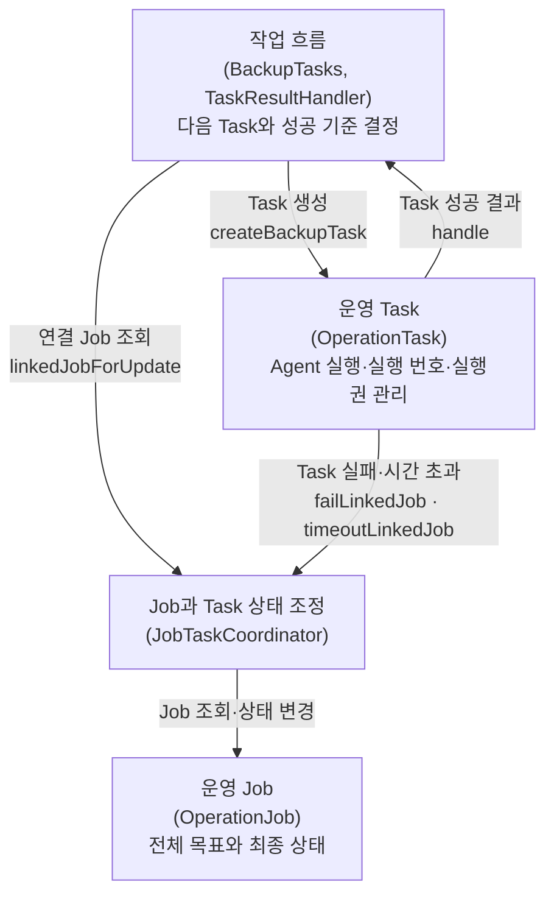
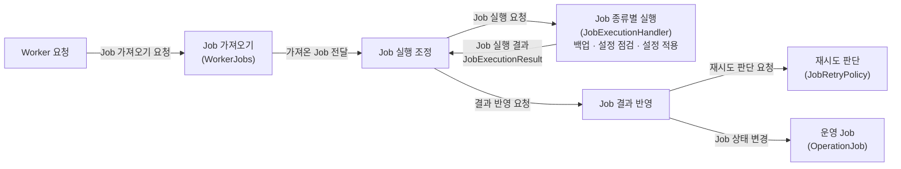
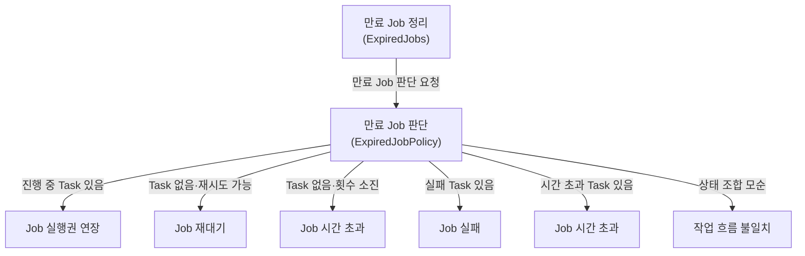

# 도메인 의존 관계

## 전체 도메인

```mermaid
flowchart LR
    REQUESTER["운영 API 호출자<br/>Console · 자동화 도구<br/>현재 사용자 인증 없음"]
    INTERNAL["내부 관리·테스트 도구<br/>실패 재현 테스트에서 사용"]
    WORKER[Job Worker]
    WORKER_CLIENT["Worker 결과 API 호출자<br/>현재 호출 구현 없음"]
    AGENT_APP[현장 Agent]

    JOB_API["Job 생성·조회<br/>(JobOperations)"]
    TASK_API["직접 Task 생성<br/>(AgentTasks)"]
    WORKER_PICKUP["Job 가져오기<br/>(WorkerJobs.claimJob)"]
    WORKER_REPORT["Job 결과 보고<br/>(WorkerJobs.succeedJob, failJob)"]
    AGENT_API["Task 확인·실행권·결과 보고<br/>(TaskClaim, TaskLease,<br/>TaskCredential, TaskReports)"]

    OPERATION["운영 실행<br/>(OperationJob, OperationTask)<br/>Job과 Task의 순서·상태 관리"]
    INVENTORY["관리 DB<br/>(ManagedDatabase, DatabaseCredential)<br/>DB 정보와 접속 인증 정보 관리"]
    AGENT["현장 실행<br/>(Agent, AgentHostMetric)<br/>실행 주체와 호스트 상태 관리"]
    POLICY["설정 정책<br/>(ConfigurationProfile, ConfigurationSnapshot,<br/>ConfigurationDrift, ConfigurationApply)"]
    BACKUP["복원 검증<br/>(BackupRestoreVerification)<br/>백업을 실제로 복원할 수 있는지 확인"]
    AUDIT["감사 기록<br/>(AuditLog)"]

    REQUESTER --> JOB_API --> OPERATION
    INTERNAL -.-> TASK_API -.-> OPERATION
    WORKER --> WORKER_PICKUP --> OPERATION
    WORKER_CLIENT -.-> WORKER_REPORT -.-> OPERATION
    AGENT_APP --> AGENT_API --> OPERATION

    OPERATION --> DB_PORT["관리 DB·인증 정보 조회<br/>(DatabaseReader, CredentialReader)"] --> INVENTORY
    OPERATION --> AGENT_PORT["Agent 확인·호스트 상태 기록<br/>(AgentReader, HostStatusWriter)"] --> AGENT
    OPERATION --> POLICY_PORT["설정 점검·적용<br/>(ConfigurationJobRunner)"] --> POLICY
    OPERATION --> BACKUP_PORT["복원 검증 준비·결과 기록<br/>(BackupPayloadBuilder,<br/>BackupVerificationWriter)"] --> BACKUP
    OPERATION --> AUDIT_PORT["중요 행위 기록<br/>(AuditWriter)"] --> AUDIT
```

## 운영 실행 내부 의존 방향

```mermaid
flowchart LR
    ADAPTER_IN[API · 만료 검사기]
    PROVIDED["요청받는 기능<br/>(provided)"]
    APPLICATION[운영 흐름 조정]
    DOMAIN["Job · Task 상태와 업무 규칙<br/>(OperationJob, OperationTask)"]
    REQUIRED["필요한 외부 기능<br/>(required)"]
    ADAPTER_OUT[저장소 · 다른 도메인 연결]

    ADAPTER_IN -->|운영 요청| PROVIDED
    PROVIDED --> APPLICATION
    APPLICATION -->|상태 변경·판단| DOMAIN
    APPLICATION -->|조회·저장·외부 실행| REQUIRED
    REQUIRED -->|외부 기능 요청| ADAPTER_OUT
```

## Job과 Task의 책임

```mermaid
flowchart TD
    JOB["운영 Job<br/>(OperationJob)<br/>전체 목표와 최종 상태"]
    WORKFLOW["작업 흐름<br/>(BackupTasks, TaskResultHandler)<br/>다음 Task와 성공 기준 결정"]
    TASK["운영 Task<br/>(OperationTask)<br/>Agent 실행·실행 번호·실행권 관리"]
    COORDINATOR["Job과 Task 상태 조정<br/>(JobTaskCoordinator)"]

    WORKFLOW -->|연결 Job 조회<br/>linkedJobForUpdate| COORDINATOR
    WORKFLOW -->|Task 생성<br/>createBackupTask| TASK
    TASK -->|Task 성공 결과<br/>handle| WORKFLOW
    TASK -->|Task 실패·시간 초과<br/>failLinkedJob · timeoutLinkedJob| COORDINATOR
    COORDINATOR -->|Job 조회·상태 변경| JOB
```

## Worker의 Job 처리 책임

```mermaid
flowchart LR
    API[Worker 요청]
    PICKUP["Job 가져오기<br/>(WorkerJobs)"]
    EXECUTION[Job 실행 조정]
    HANDLER["Job 종류별 실행<br/>(JobExecutionHandler)<br/>백업 · 설정 점검 · 설정 적용"]
    RESULT[Job 결과 반영]
    RETRY["재시도 판단<br/>(JobRetryPolicy)"]
    JOB["운영 Job<br/>(OperationJob)"]

    API -->|Job 가져오기 요청| PICKUP
    PICKUP -->|가져온 Job 전달| EXECUTION
    EXECUTION -->|Job 실행 요청| HANDLER
    HANDLER -->|Job 실행 결과<br/>JobExecutionResult| EXECUTION
    EXECUTION -->|결과 반영 요청| RESULT
    RESULT -->|재시도 판단 요청| RETRY
    RESULT -->|Job 상태 변경| JOB
```

## 실행권이 만료된 Job 처리

```mermaid
flowchart TD
    SERVICE["만료 Job 정리<br/>(ExpiredJobs)"]
    POLICY["만료 Job 판단<br/>(ExpiredJobPolicy)"]

    SERVICE -->|만료 Job 판단 요청| POLICY
    POLICY -->|진행 중 Task 있음| EXTEND[Job 실행권 연장]
    POLICY -->|Task 없음·재시도 가능| REQUEUE[Job 재대기]
    POLICY -->|Task 없음·횟수 소진| TIMEOUT[Job 시간 초과]
    POLICY -->|실패 Task 있음| FAIL[Job 실패]
    POLICY -->|시간 초과 Task 있음| TASK_TIMEOUT[Job 시간 초과]
    POLICY -->|상태 조합 모순| INCONSISTENT[작업 흐름 불일치]
```
