# 유스케이스별 객체 관계

구현 클래스보다는 외부에서 사용하는 인터페이스와 도메인 모델을 표시합니다.
화살표에는 전달하는 요청을 한글로 쓰고, 실제 메서드 이름은 괄호 안에 표시합니다.

## Operation 내부 모듈

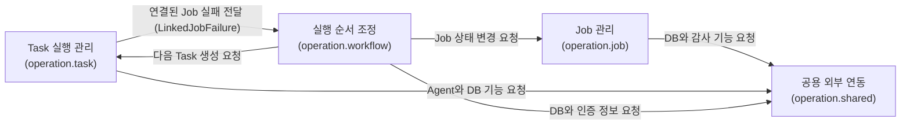

`Task → Workflow`는 구현 클래스에 직접 의존한다는 뜻이 아닙니다.

```text
TaskReportService · ExpiredTaskService
  → LinkedJobFailure 인터페이스 사용
  ← LinkedJobFailureService가 구현
```

Task 영역은 “연결된 Job을 실패 또는 시간 초과로 바꿔 달라”고 요청할 뿐입니다.
Job 조회, Lock과 상태 변경은 Workflow 영역이 담당합니다.

## 1. Job 생성과 조회

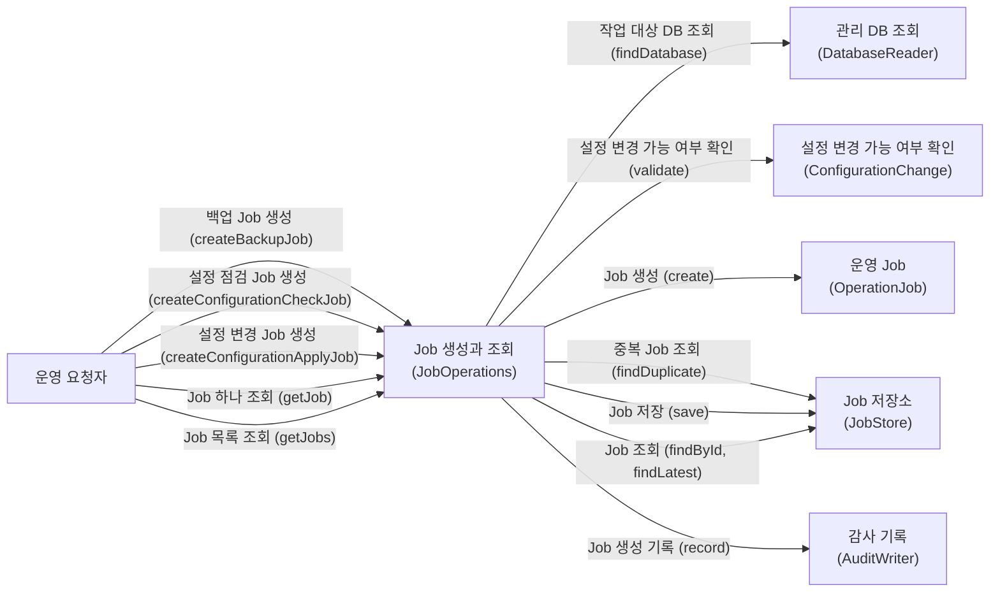

## 2. Worker의 Job 가져오기와 실행 시작

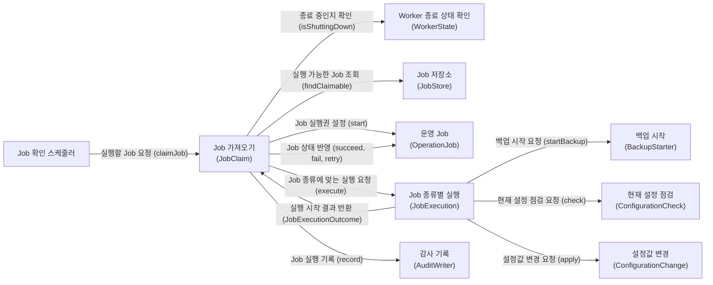

## 3. Worker의 Job 결과 보고

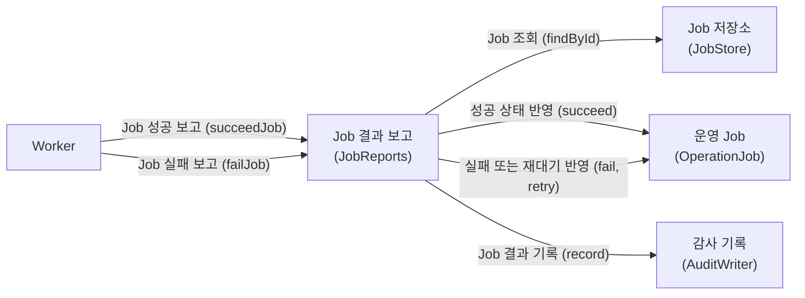

## 4. Agent의 Task 가져오기

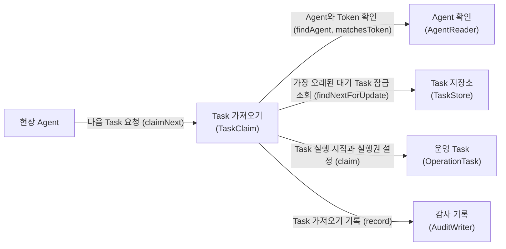

## 5. Task 실행권 갱신

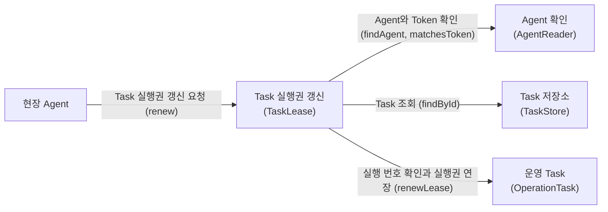

## 6. Task 실행용 DB 접속 인증 정보 조회

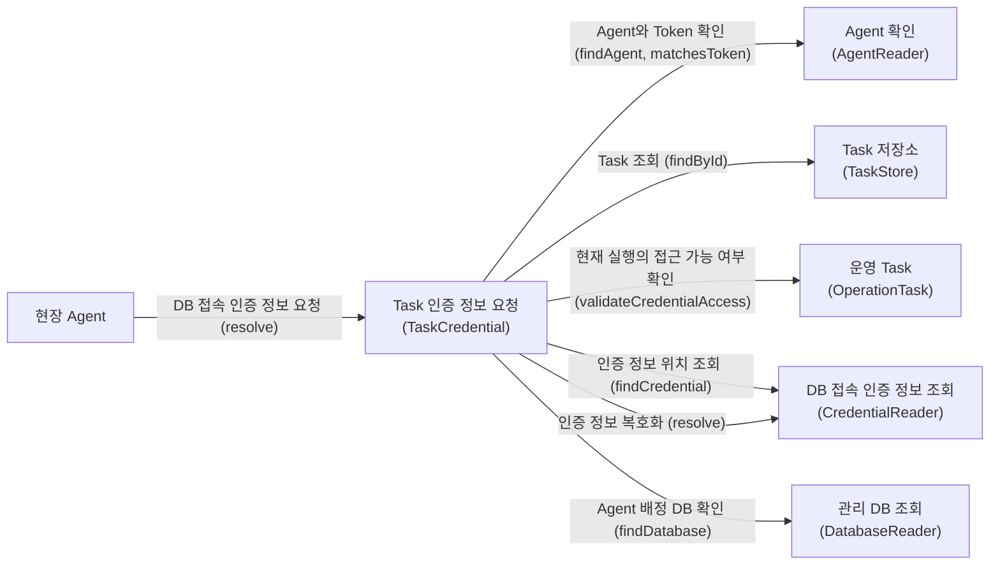

## 7. Task 성공 결과 보고와 후속 처리

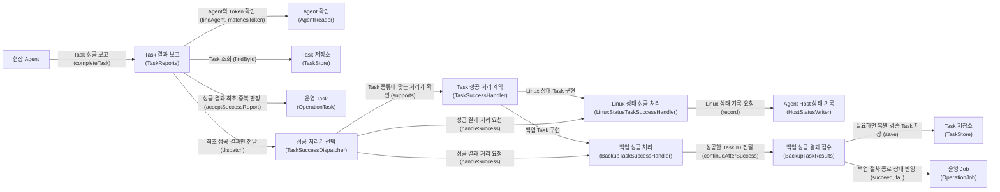

`TaskReports`는 성공 결과를 처음 받았는지만 판단합니다. 같은 결과 보고가 다시 오면
`TaskSuccessDispatcher`를 호출하지 않습니다.

`TaskSuccessHandler`는 Task 결과 접수 기능이 요구하는 출구입니다. 두 구현체는
`operation/task/adapter/integration`에 함께 있으므로 Task 결과와 관련된 객체를 한곳에서 찾을 수 있습니다.

```text
LinuxStatusTaskSuccessHandler
  → Agent Host 상태 기록

BackupTaskSuccessHandler
  → BackupTaskResults에 성공한 Task ID 전달
  → 복원 검증 Task 생성 또는 Job 종료
```

## 8. Task 실패 결과 보고

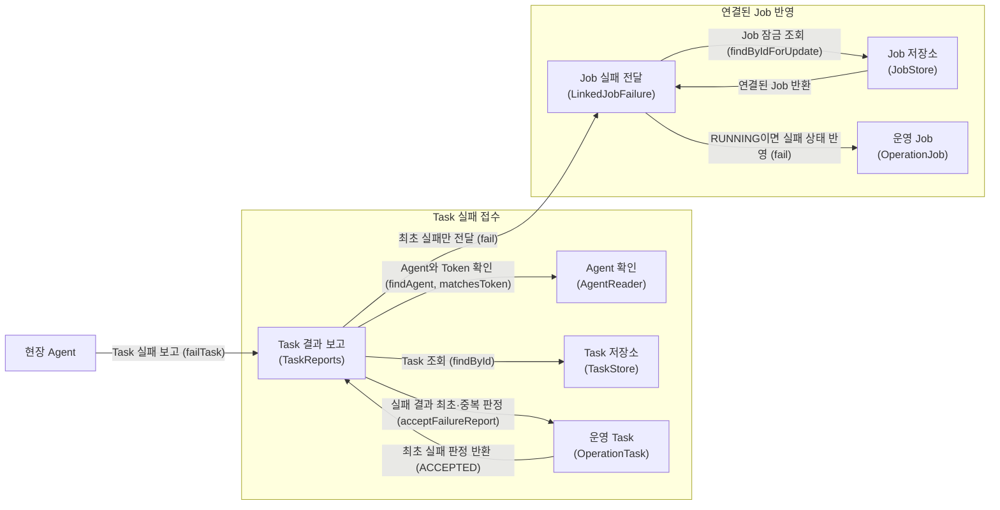

`LinkedJobFailure`는 Task 영역의 required 인터페이스이고,
`LinkedJobFailureService`가 실제 Job 잠금과 상태 변경을 수행합니다. 독립 Task처럼
연결된 Job ID가 없으면 Task만 실패하고 이 흐름은 종료됩니다.

## 9. 만료된 Task 정리

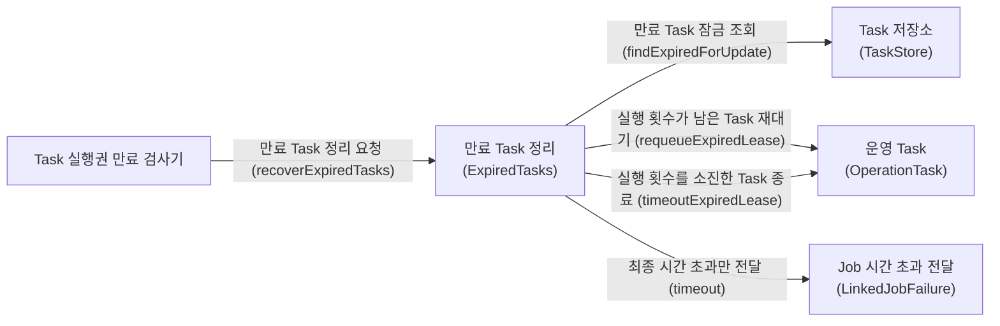

실행 횟수가 남았다면 같은 Task를 다시 대기시킵니다. 마지막 실행까지 만료된 경우에만
`LinkedJobFailure`를 통해 연결된 Job도 시간 초과로 종료합니다.

## 10. 만료된 Job 정리

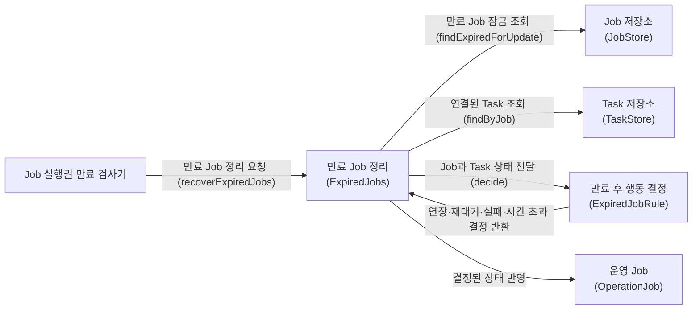

`ExpiredJobRule`은 상태를 직접 바꾸지 않고 필요한 행동만 결정합니다.
`ExpiredJobService`가 그 결정에 따라 Job 실행권을 연장하거나 Job을 재대기·실패·시간 초과로 변경합니다.
